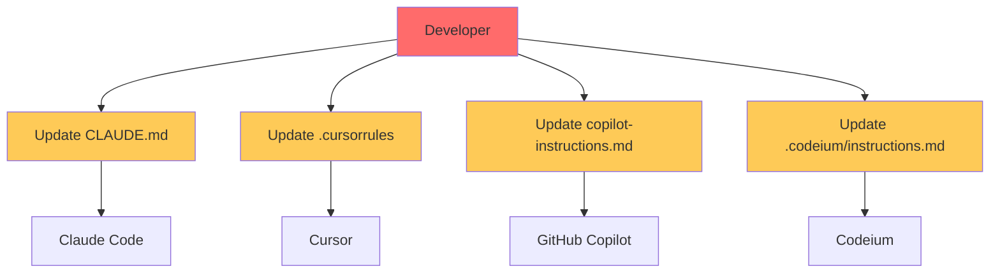
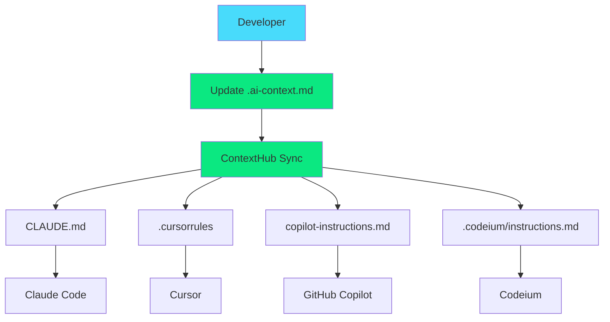

<div align="center">


[](https://badge.fury.io/js/contexthub)
</div>

**Unified Configuration for AI Coding Assistants**

> Stop managing multiple AI configuration files. One source of truth for Claude Code, Cursor, GitHub Copilot, and more.

## 🤔 The Problem

Are you tired of maintaining separate configuration files for every AI coding assistant?

```bash
your-project/
├── CLAUDE.md              # For Claude Code
├── .cursorrules           # For Cursor
├── .github/copilot-instructions.md  # For GitHub Copilot
├── .codeium/instructions.md         # For Codeium
├── .continue/context.md             # For Continue
└── .aider.conf.yml                  # For Aider
```

**This is maintenance hell.** When you update your coding standards or project context, you need to update 6+ files. They drift out of sync, contain duplicate information, and create confusion.

## ✨ The Solution

ContextHub provides a **unified configuration system** that maintains a single source of truth (`.ai-context.md`) and automatically syncs it to all your AI tools.

### 🔧 Supported Tools

| Tool | Status | Config File | Strategy |
|------|--------|-------------|----------|
| 🤖 Claude Code | ✅ Full | `CLAUDE.md` | Symlink/Copy |
| 🎯 Cursor | ✅ Full | `.cursorrules` | Symlink/Copy |
| 👨‍💻 GitHub Copilot | ✅ Full | `.github/copilot-instructions.md` | Symlink/Copy |
| 🚀 Codeium | ✅ Full | `.codeium/instructions.md` | Symlink/Copy |
| 🔄 Continue | ✅ Full | `.continue/context.md` | Symlink/Copy |
| 🎨 Aider | ⚠️ Partial | `.aider.conf.yml` | Template Generation |

## 🚀 Quick Start

### Installation

```bash
# Via npm (recommended)
npm install -g contexthub
contexthub setup

# Via curl (Unix/macOS)
curl -sSL https://raw.githubusercontent.com/seshanpillay25/contexthub/main/setup-ai-tools.sh | bash

# Via PowerShell (Windows)
iwr -useb https://raw.githubusercontent.com/seshanpillay25/contexthub/main/setup-ai-tools.ps1 | iex

# Via Python (cross-platform)
curl -sSL https://raw.githubusercontent.com/seshanpillay25/contexthub/main/setup-ai-tools.py | python3
```

### Selective Tool Setup

**Choose only the AI tools you use:**

```bash
# List available tools
contexthub build --list-tools

# Generate configs for specific tools only
contexthub build --tools claude,cursor
contexthub build --tools claude,copilot,codeium
contexthub build --tools cursor  # Just Cursor

# All available tools: claude, cursor, copilot, codeium, continue, aider
```

### Manual Setup

```bash
# Clone and run
git clone https://github.com/seshanpillay25/contexthub.git
cd contexthub
chmod +x setup-ai-tools.sh
./setup-ai-tools.sh
```

## 📋 Command Reference

### Essential Commands

```bash
# Set up ContextHub in your project
contexthub

# Verify your setup
contexthub --verify

# Validate your configuration
npm run validate

# Build tool-specific configs for all tools
npm run build

# Build for specific tools only
npm run build -- --tools claude,cursor,copilot

# Force rebuild (overwrites existing files)
npm run build -- --force

# Sync configurations (for file copy strategy)
npm run sync

# Migrate existing tool configs to unified format
npm run migrate

# List all available tools
npm run build -- --list-tools
```

### Tool Selection Examples

**Choose only the AI tools you actually use:**

```bash
# Just Claude Code
npm run build -- --tools claude

# Claude + Cursor
npm run build -- --tools claude,cursor

# Claude + GitHub Copilot + Codeium
npm run build -- --tools claude,copilot,codeium

# Cursor only
npm run build -- --tools cursor

# All tools (default behavior)
npm run build
```

**Available tools:**
- `claude` → `CLAUDE.md` (Claude Code)
- `cursor` → `.cursorrules` (Cursor IDE)  
- `copilot` → `.github/copilot-instructions.md` (GitHub Copilot)
- `codeium` → `.codeium/instructions.md` (Codeium)
- `continue` → `.continue/context.md` (Continue)
- `aider` → `.aider.conf.yml` (Aider)

## 🏗️ Implementation Strategies

ContextHub supports multiple implementation strategies to fit your workflow:

### 1. 🔗 Symlink Strategy (Recommended)

Creates symbolic links from tool-specific files to your master `.ai-context.md`.

```
.ai-context.md (master file)
├── CLAUDE.md → .ai-context.md
├── .cursorrules → .ai-context.md
└── .github/copilot-instructions.md → .ai-context.md
```

**Pros:** Real-time sync, no build step, works with any editor  
**Cons:** Requires symlink support (not available on some Windows setups)

### 2. 🔨 Build Process Strategy

Generates tool-specific files during your build process.

```bash
# Add to your package.json scripts
"prebuild": "contexthub build",
"precommit": "contexthub sync"
```

**Pros:** Works everywhere, integrates with CI/CD  
**Cons:** Requires build step, potential for drift

### 3. 🌐 Universal Format Strategy

Uses a YAML-based configuration that generates all tool-specific formats.

```yaml
# .ai-context.yml
project:
  name: "My Awesome App"
  type: "fullstack"
tools:
  claude:
    custom_instructions: "Focus on TypeScript best practices"
  cursor:
    rules: ["prefer-const", "no-any"]
```

**Pros:** Structured data, validation, tool-specific customization  
**Cons:** Learning curve, YAML syntax

### 4. 🪝 Git Hooks Strategy

Automatically syncs files on git operations.

```bash
# Syncs on commit, push, pull
contexthub install-hooks
```

**Pros:** Automatic, no manual intervention  
**Cons:** Git-dependent, hooks can be bypassed

## 📊 How It Works

### Before ContextHub


### After ContextHub


## 🎯 Benefits

### ⚡ Developer Experience
- **Single source of truth** - Update once, sync everywhere
- **Zero maintenance** - Set it up once, forget about it
- **No vendor lock-in** - Works with any combination of AI tools
- **Migration friendly** - Migrates existing configurations automatically

### 🏢 Team Benefits
- **Consistency** - Everyone uses the same AI context
- **Onboarding** - New team members get instant context
- **Standards enforcement** - Coding standards applied universally
- **Version control** - Track context changes like any other code

### 📈 Metrics
- **Setup time:** < 30 seconds
- **File size impact:** ~50% reduction in config files
- **Maintenance time:** 90% reduction
- **Team sync:** 100% consistency

## 📖 Example Configuration

```markdown
# .ai-context.md

# Project: E-commerce Platform

## Overview
Modern e-commerce platform built with Next.js, TypeScript, and Prisma.

## Architecture
- **Frontend:** Next.js 14 with App Router
- **Backend:** Next.js API routes + tRPC
- **Database:** PostgreSQL with Prisma ORM
- **Auth:** NextAuth.js with multiple providers
- **Payments:** Stripe integration
- **Deployment:** Vercel with edge functions

## Coding Standards

### TypeScript
- Use strict mode
- Prefer interfaces over types for object shapes
- Use proper return types for all functions

```typescript
// ✅ Good
interface User {
  id: string;
  email: string;
  createdAt: Date;
}

const getUser = async (id: string): Promise<User | null> => {
  return await prisma.user.findUnique({ where: { id } });
};

// ❌ Bad  
const getUser = async (id) => {
  return await prisma.user.findUnique({ where: { id } });
};
```

### React Components
- Use functional components with hooks
- Implement proper error boundaries
- Use React.memo for expensive computations

<!-- AI:CLAUDE -->
Focus on performance optimization and accessibility.
Use semantic HTML and proper ARIA labels.
<!-- /AI:CLAUDE -->

<!-- AI:CURSOR -->
Prefer inline styles using Tailwind classes.
Use shadcn/ui components when available.
<!-- /AI:CURSOR -->

## Testing Strategy
- Unit tests: Vitest + Testing Library
- E2E tests: Playwright
- API tests: Supertest
- Coverage target: 80%+

## Performance Requirements
- Core Web Vitals: All green
- First Contentful Paint: < 1.5s
- Largest Contentful Paint: < 2.5s
- Time to Interactive: < 3.5s

## Security Guidelines
- Sanitize all user inputs
- Use HTTPS everywhere
- Implement rate limiting
- Follow OWASP top 10
```

## ❓ FAQ

<details>
<summary><strong>Does this work with my existing configurations?</strong></summary>

Yes! ContextHub automatically backs up your existing configuration files and can migrate their content to the unified format.

</details>

<details>
<summary><strong>What if I need tool-specific instructions?</strong></summary>

Use HTML comments to create tool-specific sections:

```markdown
<!-- AI:CLAUDE -->
These instructions are only for Claude Code
<!-- /AI:CLAUDE -->

<!-- AI:CURSOR -->
These instructions are only for Cursor  
<!-- /AI:CURSOR -->
```

</details>

<details>
<summary><strong>Can I use YAML instead of Markdown?</strong></summary>

Yes! ContextHub supports both `.ai-context.md` and `.ai-context.yml` formats. YAML provides more structure and validation.

</details>

<details>
<summary><strong>Does this work in monorepos?</strong></summary>

Absolutely! ContextHub can create workspace-specific configurations and inherit from root-level configs.

</details>

<details>
<summary><strong>What about Windows compatibility?</strong></summary>

ContextHub includes a PowerShell script and automatically falls back to file copying if symlinks aren't available.

</details>

<details>
<summary><strong>Is this secure?</strong></summary>

Yes. ContextHub only creates local symlinks/copies and never sends data anywhere. It's a local development tool.

</details>

<details>
<summary><strong>How do I add new AI tools to an existing setup?</strong></summary>

You can easily add new tools without affecting your existing configurations:

```bash
# Add Claude to existing Cursor/Copilot setup
npm run build -- --tools claude

# Add multiple tools at once
npm run build -- --tools claude,aider,continue

# See all available tools
npm run build -- --list-tools
```

This will only generate configuration files for the specified tools, leaving your existing setup untouched.

</details>

## 🛠️ Advanced Usage

### Adding AI Tools Incrementally

Start with a few tools and add more as needed:

#### Starting Setup
```bash
# Initial setup with just Cursor and Copilot
npm run setup
# Choose only Cursor and Copilot during interactive setup
```

Your project now has:
```
your-project/
├── .ai-context.md                    # Master configuration
├── .cursorrules                      # Cursor config
└── .github/copilot-instructions.md   # Copilot config
```

#### Adding Claude Later
```bash
# Add Claude without affecting existing tools
npm run build -- --tools claude
```

Now you have:
```
your-project/
├── .ai-context.md                    # Master configuration  
├── .cursorrules                      # Cursor config (unchanged)
├── .github/copilot-instructions.md   # Copilot config (unchanged)
└── CLAUDE.md                         # Claude config (new!)
```

#### Adding Multiple Tools
```bash
# Add multiple tools at once
npm run build -- --tools aider,continue,codeium

# Or add all remaining tools
npm run build -- --force  # Generates all supported tools
```

#### Available Commands
```bash
# List all available tools
npm run build -- --list-tools

# Preview what would be generated (dry run)
npm run build -- --tools claude --dry-run

# Force regenerate existing files
npm run build -- --tools claude --force

# Generate with verbose output
npm run build -- --tools claude --verbose
```

#### Tool Selection Strategy
```bash
# Minimal setup (choose 1-2 primary tools)
npm run build -- --tools claude,cursor

# Full IDE setup (all tools for comprehensive coverage)  
npm run build -- --force

# Team setup (standardize on specific tools)
npm run build -- --tools claude,copilot,cursor
```

### Cross-Platform Support

```bash
# Use specific platform scripts
./setup-ai-tools.sh      # Unix/macOS
./setup-ai-tools.ps1     # Windows PowerShell  
python3 setup-ai-tools.py # Universal Python
```

### Advanced Configuration

```bash
# Force file copying instead of symlinks
contexthub --no-symlinks

# Verbose output for debugging
contexthub --verbose

# Setup in specific directory
contexthub --working-dir /path/to/project
```

## 📊 Comparison

| Solution | Multi-tool | Symlinks | Validation | Migration | Cross-Platform |
|----------|------------|----------|------------|-----------|----------------|
| **ContextHub** | ✅ | ✅ | ✅ | ✅ | ✅ |
| Manual copies | ❌ | ❌ | ❌ | ❌ | ⚠️ |
| Custom scripts | ⚠️ | ⚠️ | ❌ | ❌ | ❌ |
| Tool-specific | ❌ | ❌ | ⚠️ | ❌ | ⚠️ |

## 🔒 Security

ContextHub is designed with security as a fundamental principle:

✅ **Local-only operation** - No network access or data transmission  
✅ **No sensitive data storage** - Only processes your project configurations  
✅ **Minimal permissions** - Only accesses files within your project directory  
✅ **Input validation** - All user inputs are validated and sanitized  
✅ **Secure file operations** - Protection against path traversal and malicious symlinks  
✅ **No code execution** - Only static file generation, no arbitrary code execution  
✅ **Open source** - Fully auditable codebase  

### Security Features

- **Path Traversal Protection**: Prevents access to files outside project directory
- **Symlink Validation**: Ensures symlinks are safe and don't escape project bounds
- **Input Sanitization**: All configuration content is validated and sanitized
- **Backup Creation**: Original files are safely backed up before modification
- **No Network Access**: Completely offline operation, no data transmission

For full security details, see our [Security Policy](SECURITY.md).

### Quick Start for Contributors

```bash
git clone https://github.com/seshanpillay25/contexthub.git
cd contexthub
npm install
npm test
```

## 📄 License

MIT License - see [LICENSE](LICENSE) for details.

## 🔗 Links

- [Documentation](docs/)
- [Examples](examples/)
- [Templates](templates/)
- [Issues](https://github.com/seshanpillay25/contexthub/issues)
- [Discussions](https://github.com/seshanpillay25/contexthub/discussions)

---

<div align="center">

**🚀**

[⭐ Star us on GitHub](https://github.com/seshanpillay25/contexthub) | [📦 Install from npm](https://www.npmjs.com/package/contexthub) | [📚 Read the docs](docs/)

</div>